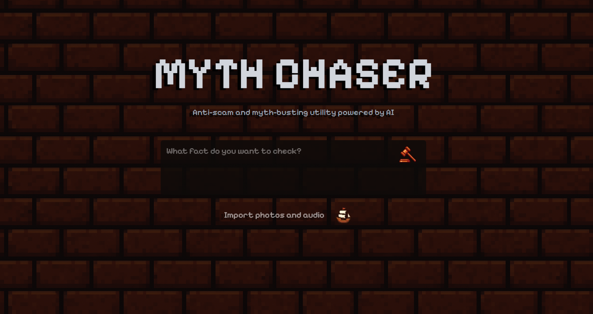

# 🎨 MYTH CHASER Frontend

**Modern React-based web interface for AI-powered fact-checking**

The MYTH CHASER frontend is a sleek, retro-gaming inspired web application built with Next.js 15 and React 19, providing an intuitive interface for content verification and anti-scam detection.



## ✨ Features

### 🎮 Retro Gaming Aesthetic
- **Pixel-Perfect Design**: Custom Pixelify Sans font with text shadows
- **Pattern Background**: Repeating retro pattern with fixed attachment
- **Color Scheme**: Dark theme with stone and orange accents
- **Nostalgic Feel**: Gaming-inspired UI elements and animations

### 📁 Advanced File Management
- **Multi-Format Support**: Images (PNG, JPG, JPEG, GIF, WebP) and Audio (MP3, WAV, M4A, OGG)
- **Multi-Language Support**: Arabic, French, and English text content
- **Drag & Drop Interface**: Full-screen drop zones with visual feedback
- **File Preview Modal**: Detailed file information with size, type and language display
- **Batch Operations**: Multiple file selection and management
- **Smart Filtering**: Automatic validation of supported file types and languages

### ⚡ Real-time Features
- **Live Upload Progress**: Visual feedback during file operations
- **Language Detection**: Automatic identification of input text language
- **Instant Validation**: Real-time file type, size, and language checking 
- **Error Handling**: Graceful error states with user-friendly messages
- **Performance Monitoring**: Optimized rendering and state management

## 🏗️ Architecture

### Modern React Stack
- **Next.js 15**: Latest framework with App Router and Turbopack
- **React 19**: Concurrent features and improved performance
- **TypeScript**: Full type safety throughout the application
- **Tailwind CSS 4**: Utility-first styling with PostCSS integration

### Component Architecture
```
app/
├── (root)/                 # Route group for main pages
│   ├── page.tsx           # Main application page
│   └── layout.tsx         # Route-specific layout
│
├── components/            # Reusable UI components
│   ├── DragOverlay.tsx    # Drag & drop visual feedback
│   ├── FileListModal.tsx  # File management interface
│   ├── FileUploadControls.tsx # Upload controls and status
│   ├── HeroSection.tsx    # Main title and branding
│   ├── LoadingIndicator.tsx # Processing state animation
│   ├── ResponseSection.tsx # Results display
│   ├── SearchForm.tsx     # Text input and submission
│   └── SubmitButton.tsx   # Form submission control
│
├── hooks/                 # Custom React hooks
│   ├── useFileUpload.ts   # File management state logic
│   └── useFormSubmission.ts # API communication logic
│
├── types/                 # TypeScript definitions
│   └── index.ts           # Shared type definitions
│
├── utils/                 # Utility functions
│   ├── apiUtils.ts        # API communication helpers
│   └── fileUtils.ts       # File manipulation utilities
│
├── globals.css            # Global styles and imports
└── layout.tsx             # Root application layout
```

### State Management
- **Custom Hooks**: Encapsulated state logic for file uploads and form submission
- **Multi-Language Support**: Language selection and automatic detection UI
- **React State**: Local component state with proper lifting
- **Type Safety**: Full TypeScript integration for all state operations